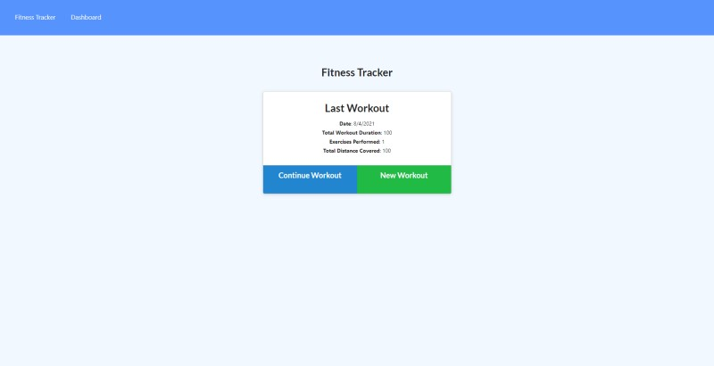
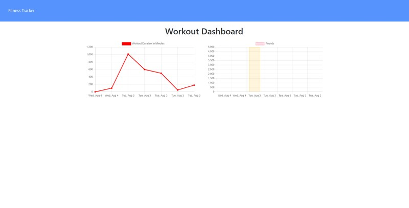

# Workout Tracker  
  
## Description  
  
This is a web app that utilizes MongoDB, Mongoose, and several other Node.js packages to deliver an interactive workout-tracking experience.  
  
## Table of Contents  
- ### [Installation](#installation)
- ### [Usage](#usage)
- ### [Screenshots](#screenshots)
- ### [Contributing](#contributing)
- ### [Questions](#questions)
  
## Installation  
  
No installation necessary. Just visit the link to the deployed app on Heroku in the [Usage](#usage) section below and sidestep installation altogether!  
  
## Usage  
  
The user can add as many exercises to as many workouts as they need to in a day. Once they've entered at least out workout, the app will track their totals both on the homepage (last workout summary) and through live charts on the dashboard (7-day totals).  
  
Check out the [deployed app](https://arcane-shelf-58681.herokuapp.com/) at Heroku.  
  
## Screenshots  
  
  
---  
  
  
  
## Contributing  
  
Neil Burt  
    
## Questions  
  
If you have any additional questions:  
  
Visit my [GitHub profile](https://github.com/neilburt).  
  
Or you can [email me](mailto:neil.burt@comcast.net).